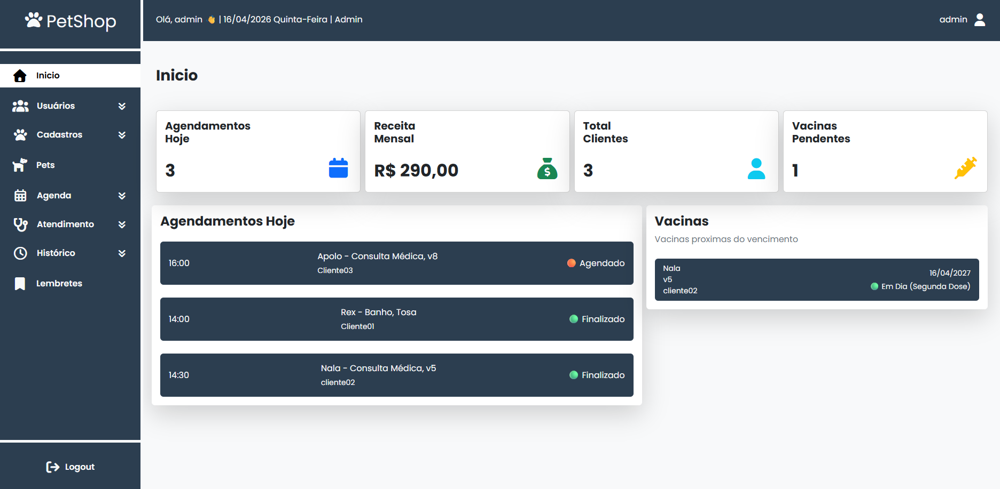
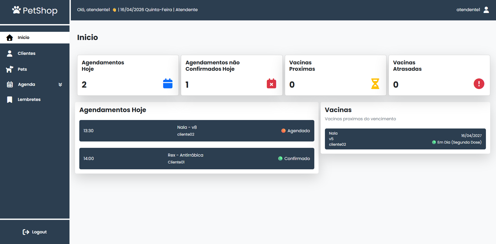
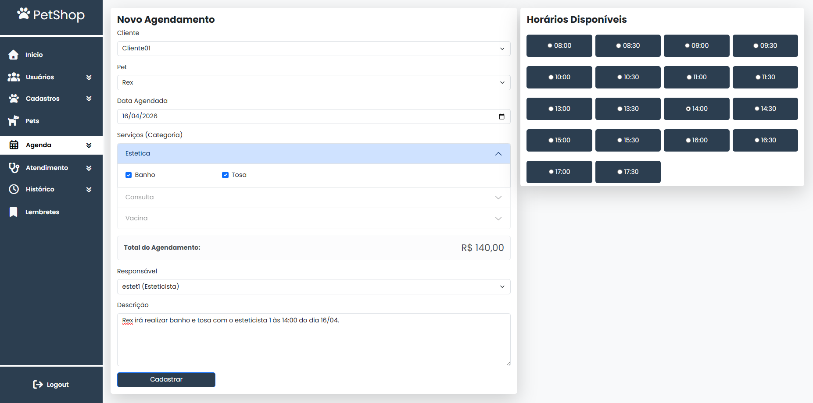
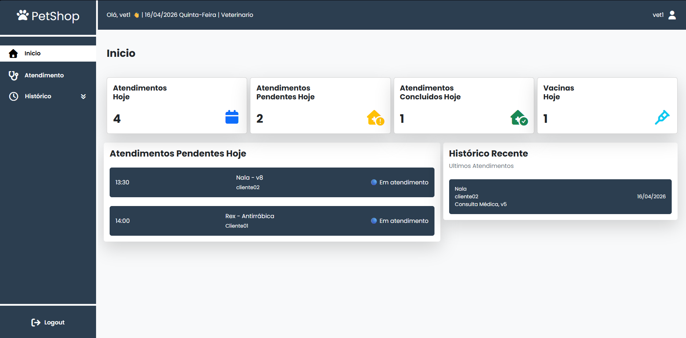
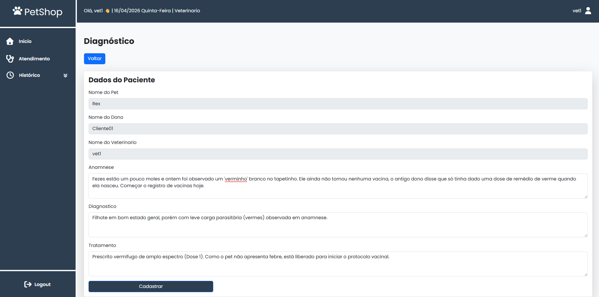
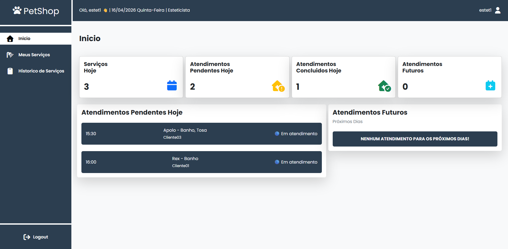
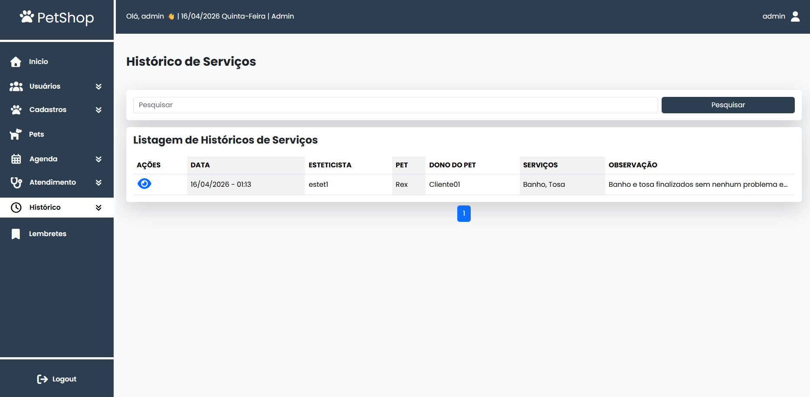

<h1 align="center">🐾 PetShop Project - ERP Hospitalar e Estético</h1>

  

### 🔑 Credenciais de Teste (Uso Interno)
O sistema possui dashboards e permissões dinâmicas. Teste com os perfis abaixo:

| Perfil | Usuário | Senha | Funcionalidade Principal |
| :--- | :--- | :--- | :--- |
| **Admin** | `admin` | `123456` | Gestão financeira e controle total de cadastros. |
| **Atendente** | `atendente1` | `123456` | Agendamentos, Confirmações e Lembretes. |
| **Veterinário** | `vet1` | `123456` | Consultas, Diagnósticos e Vacinação. |
| **Esteticista** | `estet1` | `123456` | Fila de banho, tosa e serviços estéticos. |

---

### 💻 Sobre o Projeto
Sistema ERP desenvolvido para gerenciar o fluxo operacional completo de um Petshop. A solução resolve desde a recepção e pagamento até o prontuário médico e o pós-venda (lembretes de vacina).

- 🔄 **Fluxo de Status Inteligente:** Agendado → Confirmado → Pago (Em atendimento) → Finalizado.
- 🛡️ **Segurança de Dados:** Diagnósticos travados por atendimento para evitar duplicidade.
- 📅 **Agenda Dinâmica:** Bloqueio automático de horários baseado no profissional e categoria do serviço.
- 💉 **Gestão de Vacinas:** Sistema de retornos automático com calculo de próxima dose.

---

### 🛠️ Tecnologias Utilizadas

  
  
  
  
  
  

- **Arquitetura:** MVC (Model-View-Controller)
- **Design Patterns:** Singleton (Conexão), Repository Pattern
- **Ambiente:** Servidor Linux (InfinityFree) com sincronização de Timezone UTC-4 (Manaus)

---

### 🔄 Demonstração do Fluxo Operacional

O sistema implementa uma lógica de **Fila de Espera Inteligente** baseada na categoria do serviço:

#### 1. Recepção e Triagem (Atendente)
Todo serviço começa na Agenda. O atendente filtra o profissional e o horário. Assim que o pagamento é confirmado, o status muda para **"Em Atendimento"**. É esse gatilho que faz o animal aparecer na lista do profissional responsável.

#### 2. Fluxo de Estética (Esteticista)
Diferente da clínica, o Esteticista possui o módulo **"Meus Serviços"**:
- **Fila de Trabalho:** Visualiza apenas agendamentos de categoria "Estética" que já foram pagos.
- **Execução:** O sistema permite adicionar observações específicas sobre a pelagem ou comportamento do pet durante o banho/tosa.
- **Finalização:** Ao concluir, o status é atualizado e o serviço sai da fila de pendentes, alimentando o histórico de produtividade do profissional.

#### 3. Fluxo Clínico (Veterinário)
O Veterinário acessa o módulo **"Atendimento"**:
- **Prontuário e Vacina:** Registro de anamnese e diagnósticos travados (um por agendamento).
- **Vacinação Integrada:** Ao aplicar uma vacina, o sistema registra automaticamente no histórico do pet e já gera um alerta para o módulo de Lembretes caso haja próxima dose.

#### 4. Pós-Venda e Retorno (Lembretes)
O ciclo se fecha com o Atendente monitorando a tela de **Lembretes**, onde vacinas próximas do vencimento geram alertas para que novos agendamentos sejam propostos aos clientes.

---

### 📸 Visualização por Perfil

#### **Dashboard Administrativo**
- Visão global de produtividade de todos os setores.

#### **Módulo do Atendente**
- Foco em controle de agendamentos com criação e confirmação, bem como controle de vacinações pendentes.

#### **Módulo do Veterinário**
- Foco em dados clínicos e histórico de saúde.

#### **Módulo do Esteticista**
- Interface limpa focada na execução dos serviços de banho e tosa.

---

### 🛠️ Especificações Técnicas
- **PHP 8.1 / MVC**
- **Repository Pattern:** Desacoplamento da lógica de persistência.
- **Timezone Sync:** Sincronização automática para o fuso de Manaus (UTC-4).
- **UX Segura:** Interfaces que desabilitam campos clínicos para serviços estéticos e vice-versa.

---

### 📷 Imagens
- Mais imagens em /public/Assets/screenshots

### 👨‍💻 Desenvolvedor
<h3 align="left">Washington Júnior</h3>

  
  

